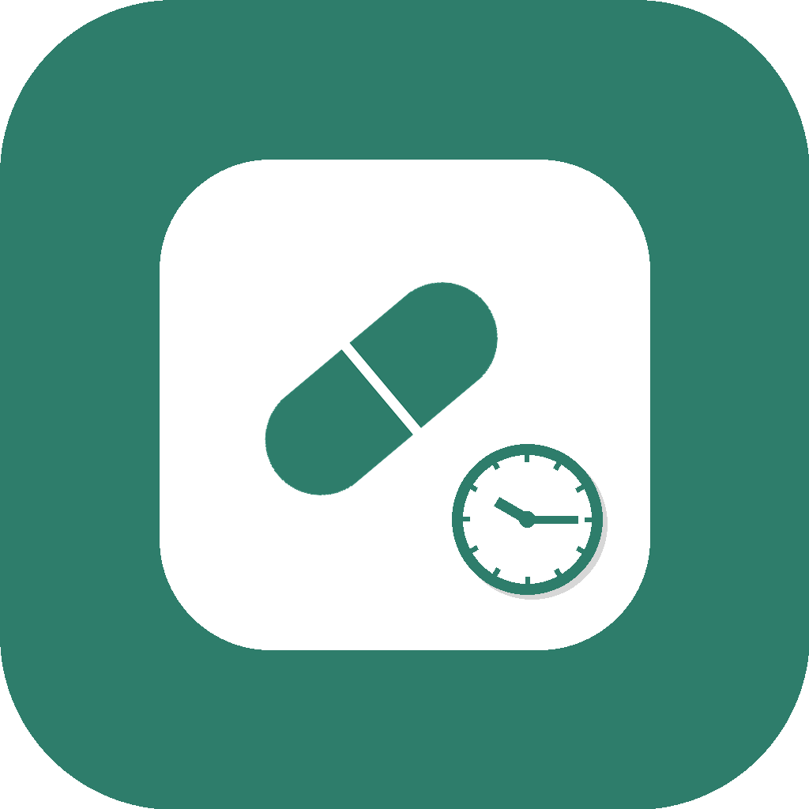

# 💊 MediTrack

[](https://flutter.dev)
[]()
[](LICENSE)

تطبيق **Flutter** لتتبّع الأدوية اليومية، التذكير بمواعيد الجرعات بتنبيهات تشبه المنبه الحقيقي، وتتبّع نسبة الالتزام بمرور الوقت.
بدون تسجيل دخول، وكل البيانات محفوظة محلياً على الجهاز فقط (SQLite) — لا خوادم، لا اتصال بالإنترنت مطلوب.

<p align="center">
  
</p>

---

## 📋 المحتويات

- [المزايا](#-المزايا)
- [البنية المعمارية](#-البنية-المعمارية)
- [قاعدة البيانات المحلية](#️-قاعدة-البيانات-المحلية-sqlite)
- [نظام التذكيرات](#-نظام-التذكيرات)
- [التشغيل محلياً](#️-التشغيل-محلياً)
- [نظام التصميم](#-نظام-التصميم)
- [التبعيات الرئيسية](#-التبعيات-الرئيسية)
- [خارطة الطريق](#️-خارطة-الطريق)
- [الترخيص](#-الترخيص)

---

## ✨ المزايا

- **إضافة / تعديل / حذف الأدوية** مع دعم أكثر من موعد تذكير لكل دواء.
- **تذكيرات محلية حقيقية** (بدون إنترنت) بصوت واهتزاز قويين ونية ملء الشاشة (Full-Screen Intent)، تعمل حتى والجهاز مقفول.
- **تسجيل الجرعات** (أُخذت / فاتت) مع سجل كامل قابل للتعديل والحذف لكل دواء.
- **إحصائيات التزام** — نسبة إجمالية، وتفصيل لكل دواء على حدة.
- **واجهة عربية RTL بالكامل**، مع نظام تصميم موحّد وحركات دخول وتفاعل سلسة.
- **تخزين محلي بالكامل عبر SQLite** — بدون حسابات أو خوادم خارجية (Offline-first).

---

## 🧱 البنية المعمارية

```
lib/
├── main.dart                         نقطة البداية، تركيب Provider، وربط الثيم
├── theme/
│   └── app_theme.dart                كل الألوان والتدرجات وتوقيتات الحركة في مكان واحد
├── models/
│   ├── medication.dart               نموذج الدواء (+ تحويل من/إلى SQLite)
│   └── dose_log.dart                 نموذج سجل الجرعة
├── providers/
│   ├── medication_provider.dart      حالة الأدوية + جدولة/إلغاء التذكيرات
│   └── dose_log_provider.dart        حالة سجلات الجرعات + حسابات الإحصائيات
├── services/
│   ├── database_helper.dart          طبقة SQLite (CRUD كامل لجدولين)
│   └── notification_service.dart     جدولة تنبيهات محلية بالمنطقة الزمنية
├── screens/
│   ├── splash_screen.dart            شاشة بداية بحركة دخول متسلسلة
│   ├── home_screen.dart              الرئيسية: هيدر + حلقة تقدّم + قائمة الأدوية
│   ├── add_medication_screen.dart    إضافة / تعديل دواء
│   ├── medication_details_screen.dart تفاصيل الدواء + تسجيل الجرعات + السجل
│   └── statistics_screen.dart        إحصائيات الالتزام
└── widgets/
    ├── medication_card.dart          بطاقة الدواء (قابلة للسحب للحذف)
    ├── fade_slide_in.dart            حركة دخول تدريجية (تلاشي + انزلاق) قابلة للتأخير
    └── tap_scale.dart                تصغير خفيف عند الضغط لإحساس تفاعلي
```

**نمط إدارة الحالة:** [`provider`](https://pub.dev/packages/provider) — كل شاشة تستمع لـ `MedicationProvider` و/أو `DoseLogProvider` عبر `Provider.of` / `Consumer`.

---

## 🗄️ قاعدة البيانات المحلية (SQLite)

جدولان أساسيان بعمليات CRUD كاملة على كل منهما عبر `database_helper.dart`:

| الجدول | Create | Read | Update | Delete |
|---|---|---|---|---|
| `medications` | إضافة دواء | عرض كل الأدوية | تعديل دواء | حذف دواء |
| `dose_logs` | تسجيل جرعة (أُخذت / فاتت) | عرض سجل الجرعات | تبديل حالة السجل | حذف سجل |

عند حذف أو تعديل دواء، تُلغى تذكيراته المجدولة تلقائياً قبل حذف السجل أو إعادة الجدولة بالمواعيد الجديدة.

---

## 🔔 نظام التذكيرات

يعتمد على [`flutter_local_notifications`](https://pub.dev/packages/flutter_local_notifications) مع [`timezone`](https://pub.dev/packages/timezone) لضبط التوقيت المحلي الصحيح للجهاز. كل تذكير:

- يتكرر **يومياً** في نفس الوقت (`matchDateTimeComponents: DateTimeComponents.time`).
- بأولوية وأهمية `max`، صوت واهتزاز مخصص بنمط متكرر.
- `fullScreenIntent: true` — يظهر تلقائياً فوق شاشة القفل بإحساس "منبه" حقيقي، لا إشعار عادي فقط.

---

## ⚙️ التشغيل محلياً

### المتطلبات

- [Flutter SDK](https://docs.flutter.dev/get-started/install) (‏3.0.0 أو أحدث)
- جهاز أو محاكي Android/iOS

### التثبيت

```bash
git clone https://github.com/Hafsa-Alazazi/MediTrack_App.git
cd MediTrack_App
flutter pub get
flutter run
```

### إعداد أذونات Android (مطلوب للتذكيرات)

في `android/app/src/main/AndroidManifest.xml`، أضف قبل وسم `<application>`:

```xml
<uses-permission android:name="android.permission.POST_NOTIFICATIONS"/>
<uses-permission android:name="android.permission.SCHEDULE_EXACT_ALARM"/>
<uses-permission android:name="android.permission.USE_EXACT_ALARM"/>
<uses-permission android:name="android.permission.RECEIVE_BOOT_COMPLETED"/>
<uses-permission android:name="android.permission.WAKE_LOCK"/>
```

وفي `android/app/build.gradle.kts`:

```kotlin
compileOptions {
    isCoreLibraryDesugaringEnabled = true
}
dependencies {
    coreLibraryDesugaring("com.android.tools:desugar_jdk_libs:2.1.4")
}
```

> ⚠️ بعض إصدارات Android (مثل Samsung One UI) تخفي إذن "الظهور فوق التطبيقات الأخرى" افتراضياً.
> فعّله يدوياً من: **الإعدادات ← التطبيقات ← MediTrack ← الأذونات الإضافية**.

### تحديث أيقونة التطبيق

الأيقونة مُدارة عبر [`flutter_launcher_icons`](https://pub.dev/packages/flutter_launcher_icons)، وتُولَّد من `assets/icon/app_icon_v2.png`. لإعادة توليدها بعد تغيير الصورة:

```bash
flutter pub get
flutter pub run flutter_launcher_icons
```

---

## 🎨 نظام التصميم

كل الألوان والتدرجات وتوقيتات الحركة مركزية في `lib/theme/app_theme.dart` (`AppColors` و `AppMotion`) — أي تغيير لون أو مدة حركة يتم من مكان واحد فقط وينعكس على كل الشاشات تلقائياً.

الحركات المستخدمة:

| الحركة | الاستخدام |
|---|---|
| `FadeSlideIn` | دخول تدريجي متتابع لعناصر القوائم |
| `TweenAnimationBuilder` | حلقة التقدّم بالرئيسية وأشرطة الإحصائيات |
| `TapScale` | تصغير خفيف عند الضغط على البطاقات والأزرار |
| `Dismissible` | سحب بطاقة الدواء للحذف |

---

## 🧩 التبعيات الرئيسية

| الحزمة | الاستخدام |
|---|---|
| `provider` | إدارة الحالة |
| `sqflite` + `path` | قاعدة بيانات محلية |
| `flutter_local_notifications` | التذكيرات المحلية |
| `timezone` + `flutter_timezone` | ضبط التوقيت المحلي للتذكيرات |
| `intl` | تنسيق التواريخ/الأوقات |
| `flutter_launcher_icons` (dev) | توليد أيقونة التطبيق |

---

## 🗺️ خارطة الطريق

- [ ] وضع داكن اختياري (Dark Mode)
- [ ] نسخ احتياطي/استعادة للبيانات
- [ ] تنبيه اليوم القادم للجرعات المتبقية

---

## 📌 ملاحظات

- لا يوجد أي اتصال بالإنترنت أو خادم خارجي — التطبيق يعمل بالكامل دون اتصال (Offline-first).
- لا يوجد نظام تسجيل دخول أو حسابات مستخدمين.
- هذا المشروع لأغراض تعليمية/شخصية، وليس بديلاً عن استشارة طبية أو دوائية مختصة.

---

## 📄 الترخيص

هذا المشروع مرخّص تحت [MIT License](LICENSE) — يمكنك استخدامه وتعديله بحرية مع الإشارة للمصدر.

---

<p align="center">صُنع بـ 💙 باستخدام Flutter</p>
